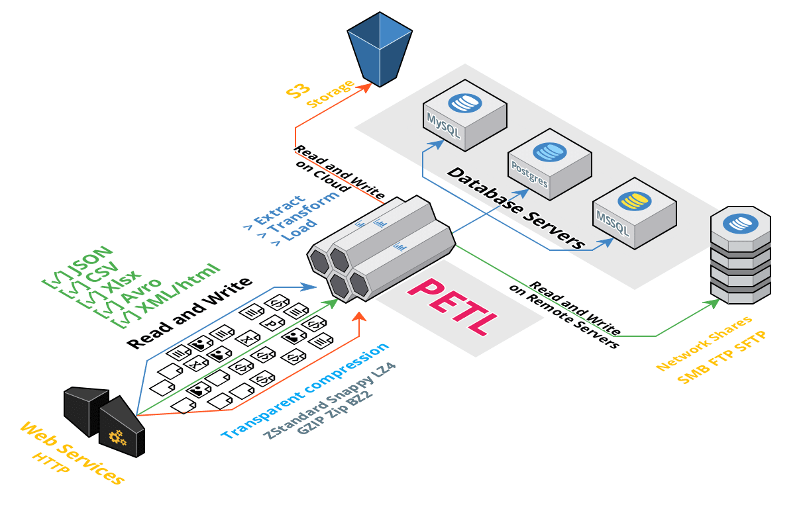

petl - Extract, Transform and Load
===================================================

``petl`` is a general purpose Python package for extracting, transforming and
loading tables of data.

Resources
---------

- Documentation: http://petl.readthedocs.org/
- PyPI: http://pypi.python.org/pypi/petl
- Conda: https://anaconda.org/conda-forge/petl
- Discussion: http://groups.google.com/group/python-etl

DevOps Status
-------------

+------------+---------------------+-------------------+
| Workflow   |                                         |
+============+=====================+===================+
| PyPI       |  |pypi_downloads|   |  |pypi_monthly|   |
+------------+---------------------+-------------------+
| Conda      |  |conda_downloads|  |  |conda_version|  |
+------------+---------------------+-------------------+
| CI         |  |ga_tests|         |  |ci_coveralls|   |
+------------+---------------------+-------------------+
| Release    |  |ga_release|       |  |ga_conda|       |
+------------+---------------------+-------------------+
| Docs       |  |ci_readthedocs|   |   |zenodo|        |
+------------+---------------------+-------------------+

.. |pypi_downloads|    image:: https://static.pepy.tech/badge/petl
    :target: https://pepy.tech/project/petl
    :alt: PyPI Downloads

.. |pypi_monthly|    image:: https://static.pepy.tech/badge/petl/month
    :target: https://pepy.tech/project/petl
    :alt: PyPI Downloads/Month

.. |conda_downloads|    image:: https://img.shields.io/conda/dn/conda-forge/petl.svg
    :target: https://anaconda.org/conda-forge/petl
    :alt: Conda Downloads

.. |conda_version|    image:: https://img.shields.io/conda/vn/conda-forge/petl.svg
  :target: https://github.com/petl-developers/petl/releases
  :alt: Petl releases

.. |ga_tests|    image:: https://github.com/petl-developers/petl/actions/workflows/test-changes.yml/badge.svg
    :target: https://github.com/petl-developers/petl/actions/workflows/test-changes.yml
    :alt: Continuous Integration build status

.. |ga_release|    image:: https://github.com/petl-developers/petl/actions/workflows/publish-release.yml/badge.svg
    :target: https://github.com/petl-developers/petl/actions/workflows/publish-release.yml
    :alt: PyPI release status

.. |ga_conda|    image:: https://github.com/conda-forge/petl-feedstock/actions/workflows/conda-build.yml/badge.svg
    :target: https://github.com/conda-forge/petl-feedstock/actions/workflows/conda-build.yml
    :alt: Conda Forge release status

.. |ci_coveralls|    image:: https://coveralls.io/repos/github/petl-developers/petl/badge.svg?branch=master
    :target: https://coveralls.io/github/petl-developers/petl?branch=master
    :alt: Coveralls release status

.. |ci_readthedocs|    image:: https://readthedocs.org/projects/petl/badge/?version=stable
    :target: http://petl.readthedocs.io/en/stable/?badge=stable
    :alt: readthedocs.org release status

.. |zenodo|    image:: https://zenodo.org/badge/2233194.svg
    :target: https://zenodo.org/badge/latestdoi/2233194
    :alt: Zenodo Publication
