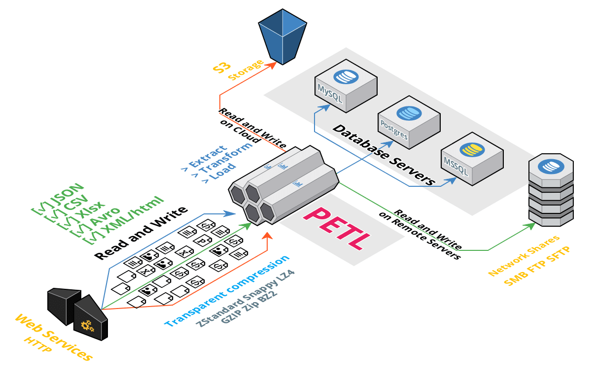

.. module:: petl

petl - Extract, Transform and Load
===================================

:mod:`petl` is a general purpose Python package for extracting, transforming
and loading tables of data.

Resources
---------

- Documentation: http://petl.readthedocs.org/
- Mailing List: http://groups.google.com/group/python-etl
- Source Code: https://github.com/petl-developers/petl
- Download: 
  - PyPI: http://pypi.python.org/pypi/petl
  - Conda Forge:https://anaconda.org/conda-forge/petl

.. note::

   - Version 2.0 will be a major milestone for :mod:`petl`.
   - This version will introduce some changes that could affect current behaviour.
   - We will try to keep compatibility to the maximum possible, except 
     when the current behavior is inconsistent or have shortcomings.
   - The biggest change is the end of support of Python `2.7`.
   - The minimum supported version will be Python `3.6`.

Getting Help
-------------

Please feel free to ask questions via the mailing list
(python-etl@googlegroups.com).

To report installation problems, bugs or any other issues please email
python-etl@googlegroups.com or `raise an issue on GitHub
<https://github.com/petl-developers/petl/issues/new>`_.

For an example of :mod:`petl` in use, see the `case study on comparing tables
<http://nbviewer.ipython.org/github/petl-developers/petl/tree/master/notes/case_study_1.ipynb>`_.

Contents
--------

For an alphabetic list of all functions in the package,
see the :ref:`genindex`.

.. toctree::
   :maxdepth: 2

   install
   intro
   io
   transform
   util
   config
   changes
   contributing
   acknowledgments
   related_work

Indices and tables
------------------

* :ref:`genindex`
* :ref:`modindex`
* :ref:`search`
